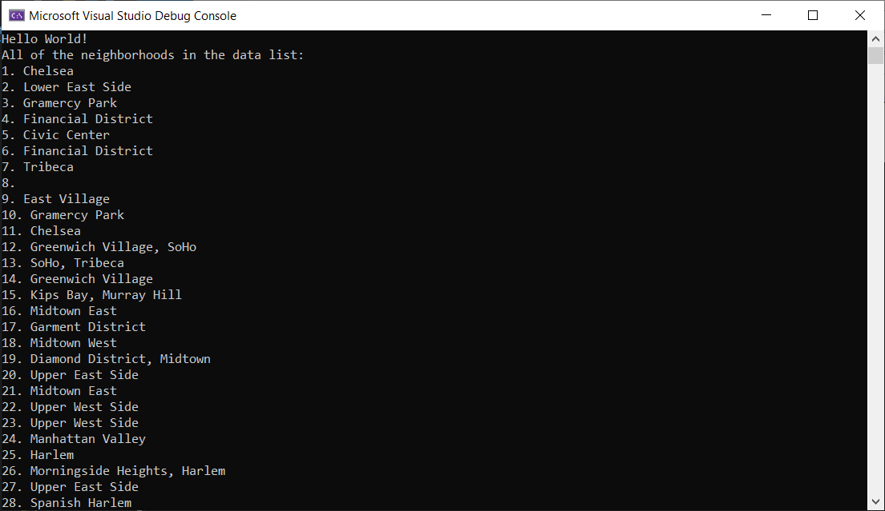
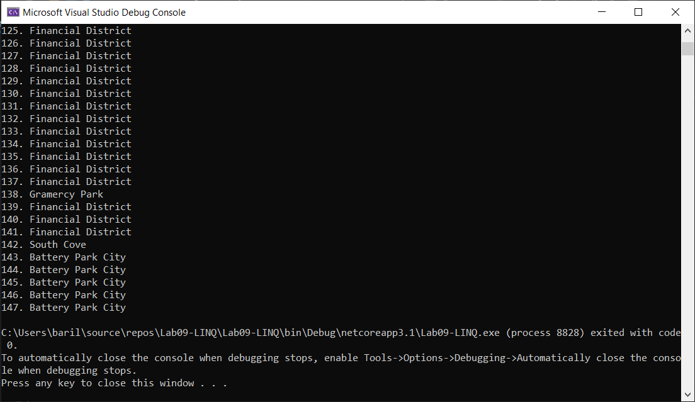

# Console Application LINQ

## LINQ in Manhattan

Lab09-LINQ

*Author: Na'ama Bar-Ilan*

----

## Description

This is a C# console application that brings in data from an external file, with data on all Manhattan neiborhoods, reads the data, and then filters it based on specific values. 

---

### Getting Started
Clone this repository to your local machine.

```
$ git clone [https://github.com/NaamaBarIlan/Lab09-LINQ.git]
```

### To run the program from Visual Studio:
Select ```File``` -> ```Open``` -> ```Project/Solution```

Next navigate to the location you cloned the Repository.

Double click on the ```Lab09-LINQ``` directory.

Then select and open ```Lab09-LINQ```

---

### Visuals

#### Application Start


#### Application End


---

### Change Log


------------------------------
